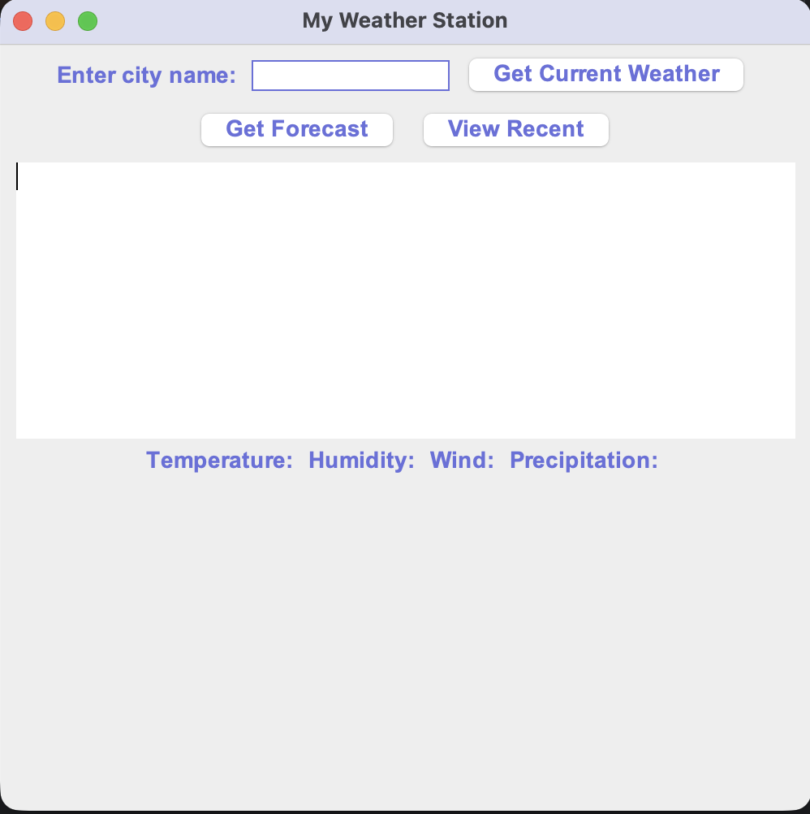
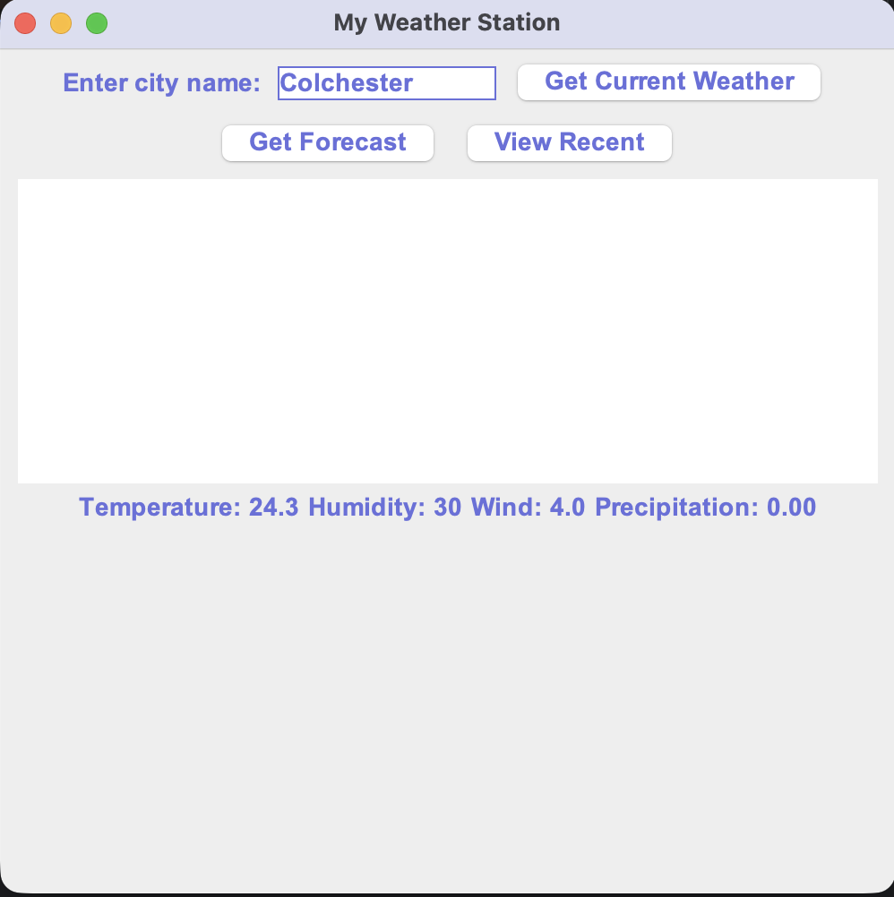
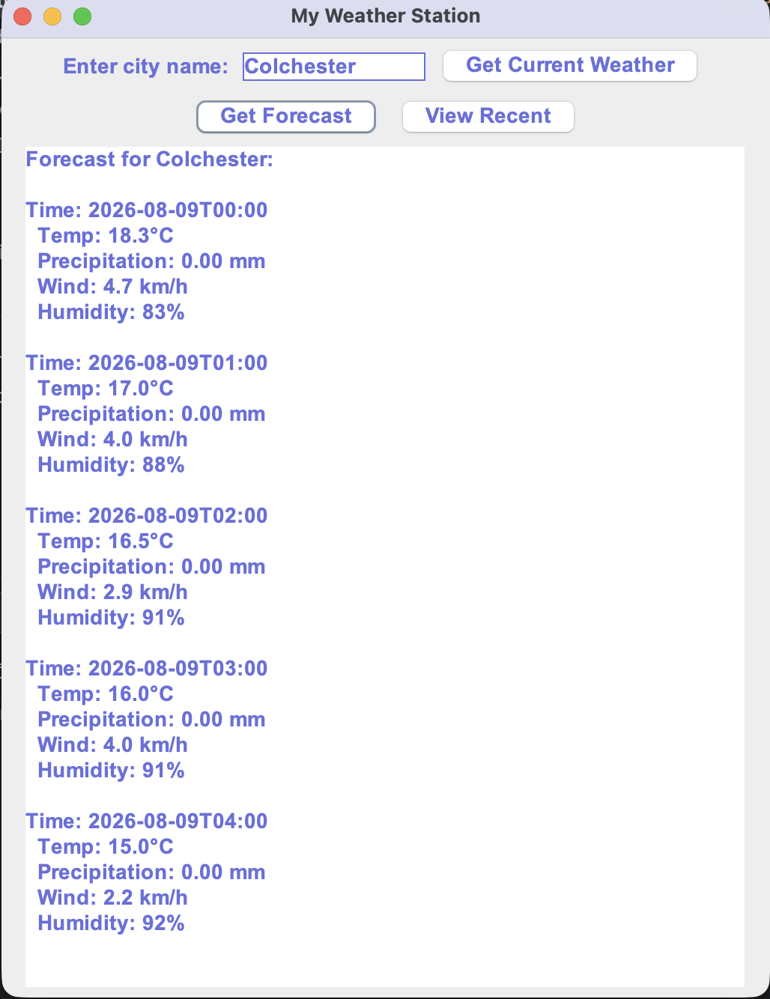
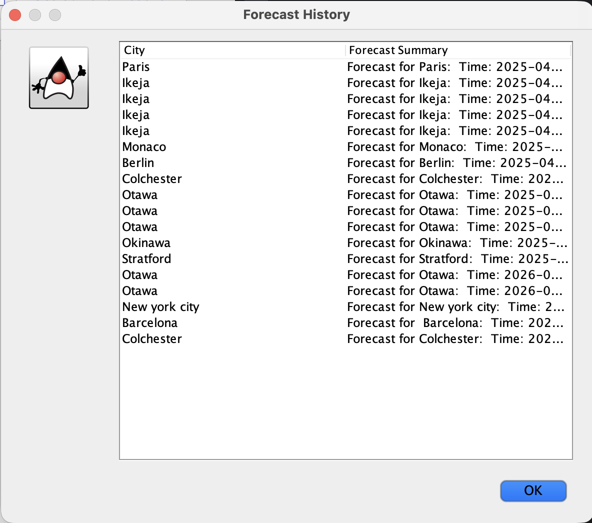
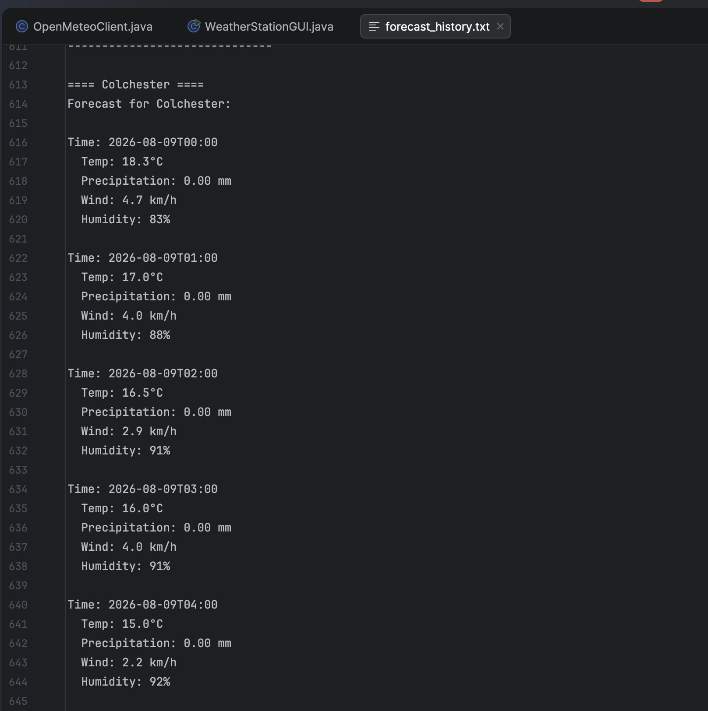
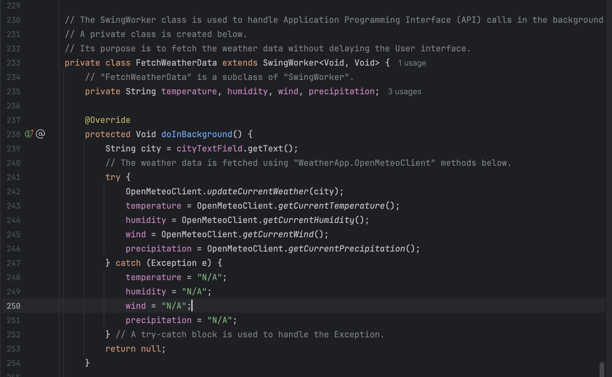
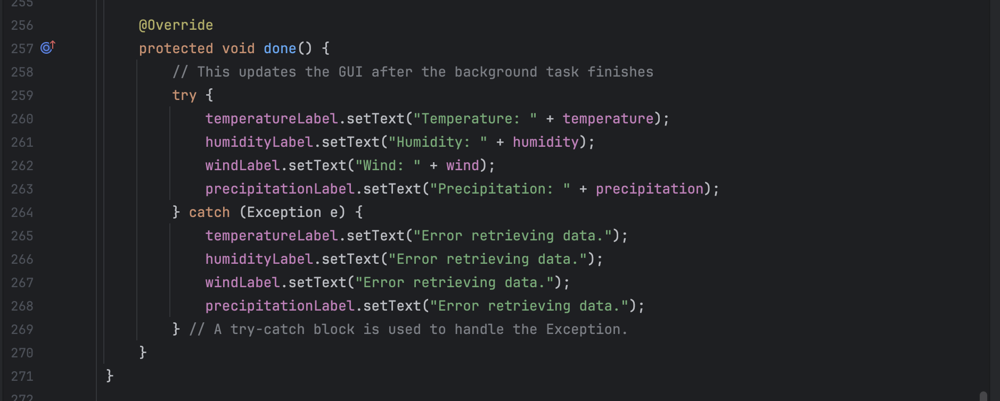

# weather-station-java
The Weather Station is a Java desktop application that retrieves live weather information using the Open-Meteo API. It allows users to search for locations and view current weather conditions through an intuitive graphical interface.

This project was developed as part of my Computer Systems Engineering studies to strengthen my understanding of object-oriented programming, API integration, graphical user interface development, and software design.

## Features
- Search weather by location
- Retrieve live weather data from the Open-Meteo API
- Display current weather conditions
- User-friendly graphical interface
- Input validation and error handling
- Modular object-oriented design

## Challenges
During development I learned how to work with external APIs, parse JSON data, structure a Java application using object-oriented principles, and build a responsive graphical interface.

## Future Improvements
- 7-day weather forecast
- Save favorite locations
- Dark mode
- Better UI styling
- Weather alerts

## Screenshots
## Main interface

## Current weather data

## Forecast data

## Forecast history

## Key API code

## Running the Project
1. Clone the repository.
2. Open the project in IntelliJ IDEA.
3. Run the GUI class.
